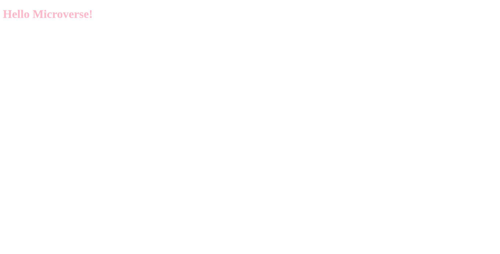

# Hello Microverse project

> set up of a "Hello world" repository. No complex coding

Additional description about the project and its features.

## Built With

- HTML, CSS
- stylelint

## Authors

👤 **Author1**

- GitHub: [@githubhandle](https://github.com/topeogunleye)
- Twitter: [@twitterhandle](https://twitter.com/topeogunleye21)
- LinkedIn: [LinkedIn](https://linkedin.com/in/ogunleye)

## 🤝 Contributing

Contributions, issues, and feature requests are welcome!

Feel free to check the [issues page](https://github.com/topeogunleye/Hello-Microverse-project/issues).

## Show your support

Give a ⭐️ if you like this project!

## 📝 License

This project is [MIT](./MIT.md) licensed.
